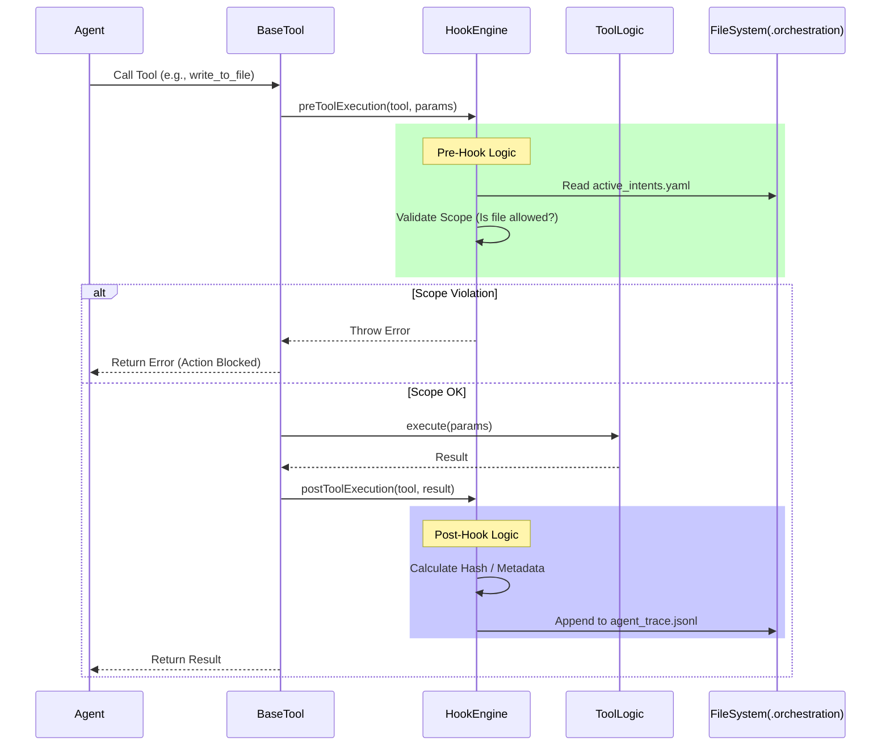
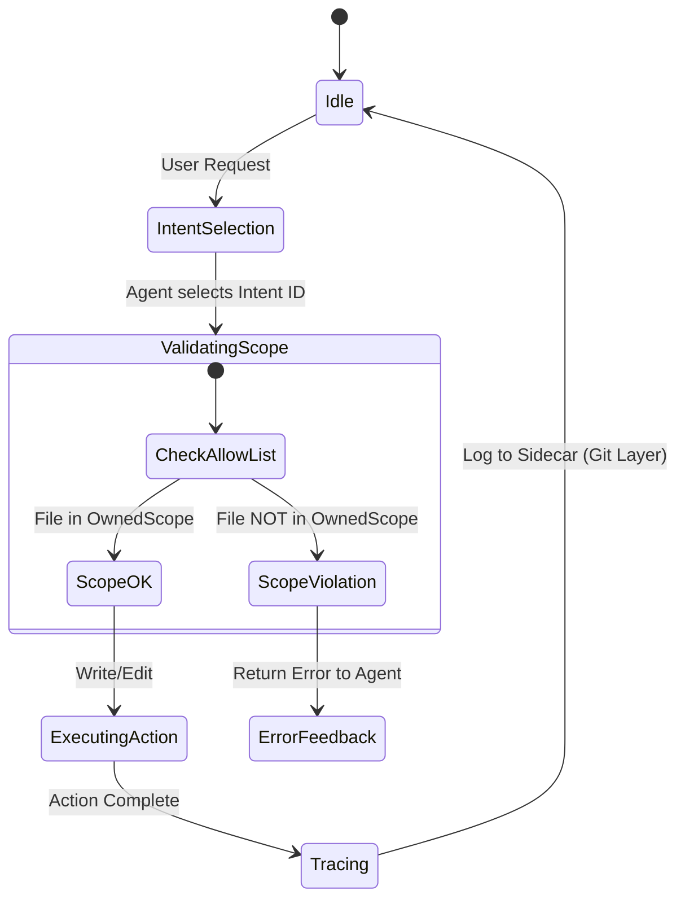

# Roo Code: AI-Native IDE Architecture Report

## 1. VS Code Extension Architecture

The Roo Code extension operates as an AI-powered coding assistant deeply integrated into VS Code. Its core architecture revolves around a task-based loop that interacts with an LLM (Large Language Model) to execute coding tasks.

### Core Components

- **Task Management (`Task.ts`)**: This is the central nervous system of the extension. It manages the lifecycle of a user request (Task). It handles the conversational loop, API interactions with the LLM providers (Anthropic, OpenAI, etc.), and state management. The `recursivelyMakeClineRequests` method is the heart of the loop, handling streaming responses and coordinating tool execution.
- **Assistant Message Presentation (`presentAssistantMessage.ts`)**: This module is responsible for parsing the AI's response and executing the visible actions. It identifies tool calls (like "write_to_file", "execute_command") in the response stream and dispatches them to the appropriate tool handlers. It acts as the bridge between the AI's intent and the system's execution.
- **Prompt Engineering (`src/core/prompts`)**: The behavior of the AI is governed by a dynamic system prompt constructed in `system.ts`. This prompt aggregates various sections (Capabilities, Rules, System Info) to define the agent's persona and constraints.
- **Tools System**: Tools are the "hands" of the agent. Defined in `src/shared/tools.ts` and implemented in `src/core/tools/`, they provide capabilities like file manipulation, command execution, and browser interaction.

## 2. Agent Architecture (Phase 0 Findings)

As documented in `ARCHITECTURE_NOTES.md`, the initial exploration revealed a modular but direct architecture:

- **Direct Execution**: Tools were called directly from the message parser (`presentAssistantMessage.ts`) without an intermediate governance layer.
- **Prompt Construction**: The system prompt is built dynamically, allowing for context injection.
- **State Management**: Conversation history and task state are managed within the `Task` instance, but there was no persistent "Intent" state spanning across tasks or safeguarding execution scope.

## 3. Hook System Architecture

To transform Roo Code into an "AI-Native IDE" with governance and traceability, we introduced a Deterministic Hook System.

### Architectural Decisions

1.  **Middleware Pattern**: We implemented a `HookEngine` class acting as middleware. This engine intercepts every tool execution _before_ and _after_ the core logic runs.
    - **Pre-Hook**: Used for validation (Policy Enforcement), Context Injection, and Optimistic Locking.
    - **Post-Hook**: Used for Sidecar Tracing (AI-Native Git) and State Updates.
2.  **Integration at Base Layer**: Instead of modifying every single tool implementation or the top-level loop, we integrated the hook calls into `BaseTool.ts`. Since all tools extend `BaseTool`, this ensures `HookEngine` is universally applied to `write_to_file`, `execute_command`, etc., with minimal code intrusion.
3.  **Sidecar Orchestration**: We utilize a hidden `.orchestration/` directory to store machine-readable state (`active_intents.yaml`, `agent_trace.jsonl`). this separates the agent's meta-state from the user's project code.
4.  **Intent-Driven Protocol**: We enforce a "Handshake" where the agent must first select an active intent (`select_active_intent`) before performing any destructive actions. This intent defines the "Owned Scope" (which files can be edited).

### Diagrams and Schemas

#### Hook System Flow

#### State Machine Transition

## 4. Implementation Details

- **`HookEngine.ts`**: The singleton class managing the hooks.
- **`BaseTool.ts`**: The abstract class instrumented with `preToolExecution` and `postToolExecution` calls.
- **`SelectActiveIntentTool`**: A new primitive allowing the agent to "login" to a specific task context.
- **`.orchestration/`**: The local database for the agent's cognitive state.

---

## 5. Proof of Execution (Verification)

- [x] **Handshake Verified**: Active intent selected.
- [x] **Authorized Action**: Successful modification within `owned_scope`.
- [x] **Semantic Tracing**: Action logged to `.orchestration/agent_trace.jsonl`.
- [x] **Policy Enforcement**: Out-of-scope actions blocked by `HookEngine`.
